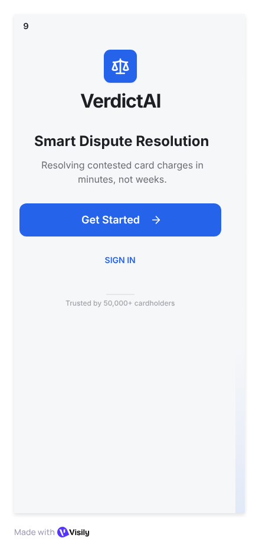
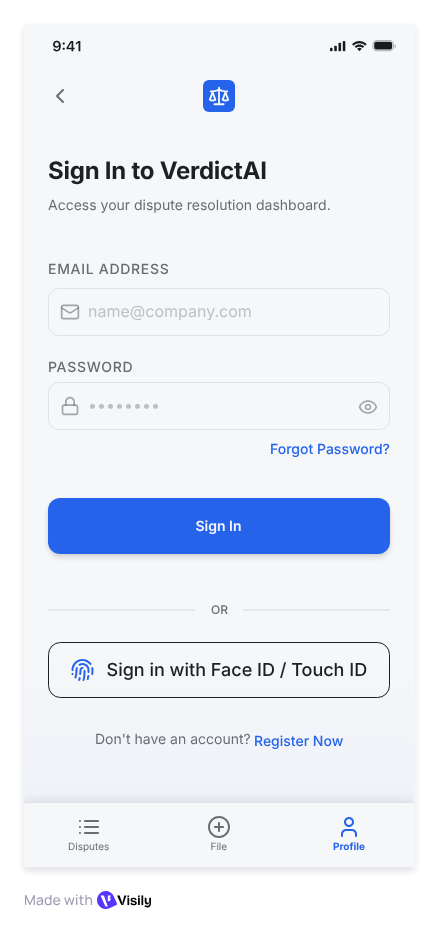
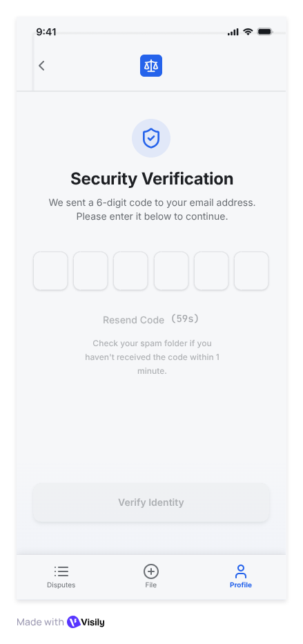
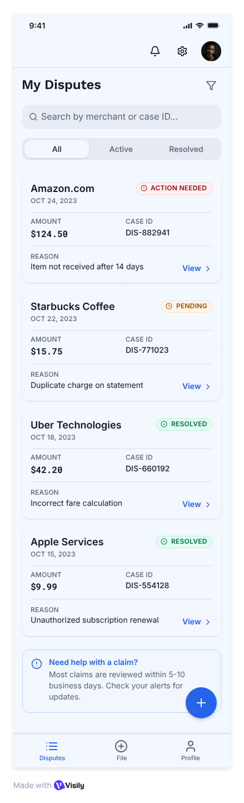
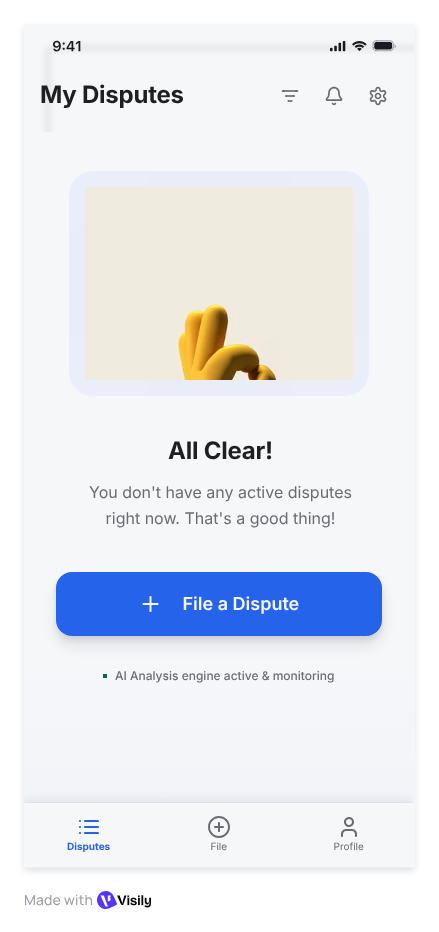
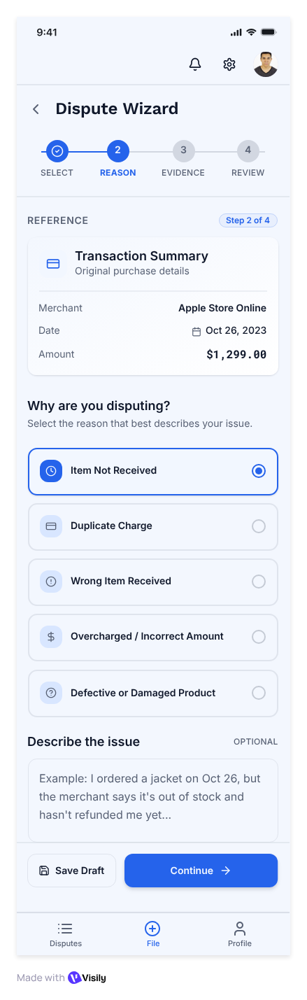
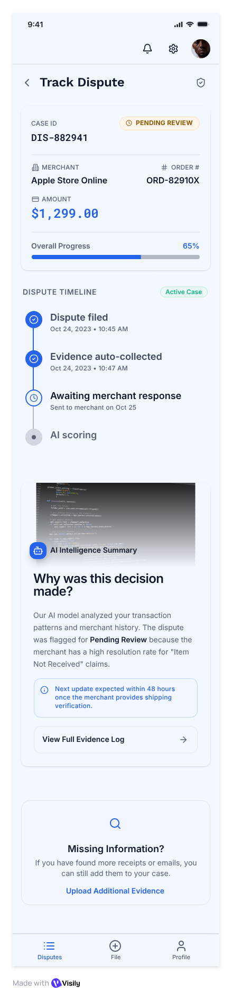
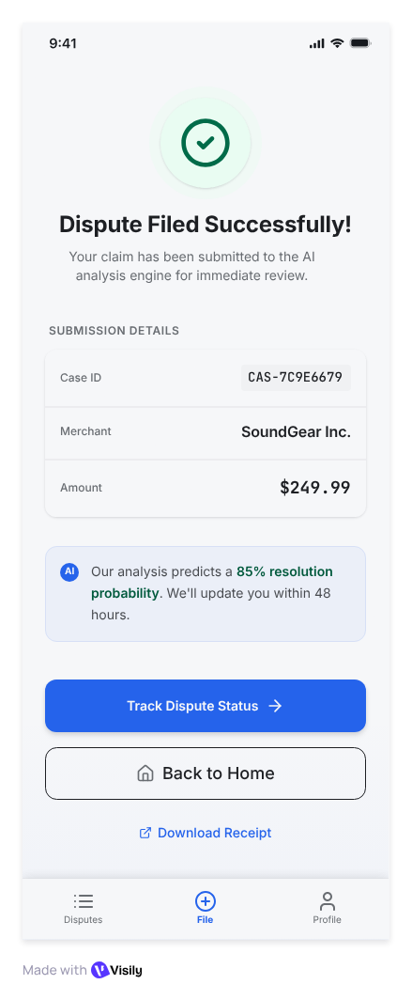
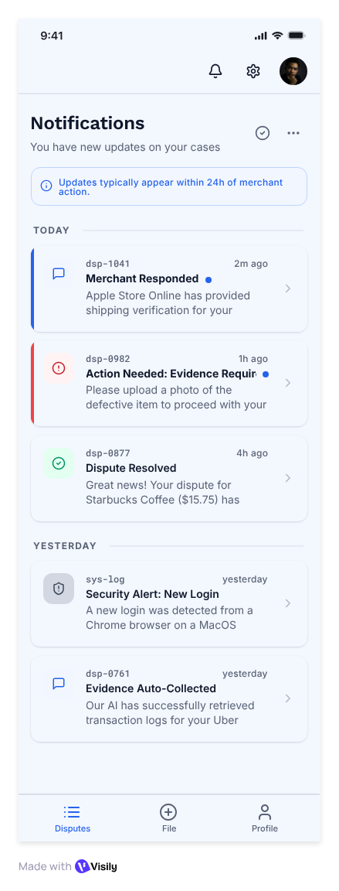
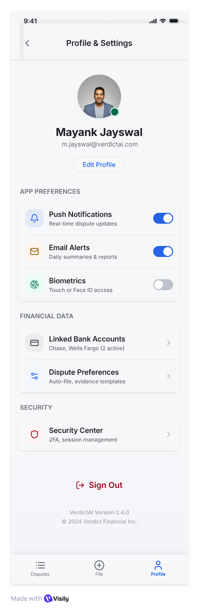

# 📱 VerdictAI: Card Member Mobile App — UX Wireframes & Screen Flows

> **Course:** IT644 — Application Development Group Project / Web Services & SOA  
> **Instructor:** Prof. JayPrakash Lalchandani  
> **Deliverable:** Phase 1 Deliverable #12 — Card Member Mobile App UX Wireframes & Screen Flows  
> **Lead / Author:** Mayank Jayswal (`202512093`) — Mobile Engineer (Card Member App)  
> **Target Framework:** React Native + Expo (TypeScript), React Navigation v7, Axios  

---

## 📌 1. Overview & Objectives

In traditional banking and card networks, cardholders facing unauthorized charges or billing disputes must navigate opaque phone trees, fill out paper forms, or wait 2 to 6 weeks for resolution. 

The **VerdictAI Card Member Mobile Application** provides an instant, transparent, and frictionless mobile-first dispute resolution experience:
1. **Frictionless Ingestion:** Direct dispute initiation from settled transactions with guided reason categorisation.
2. **Multi-Modal Evidence Upload:** Client-side validated file uploads (receipts, delivery confirmations, chat screenshots) capped at 10 MB per payload.
3. **Transparent Real-Time Tracking:** Live 48-hour SLA countdown timer paired with deterministic visual state-machine progression.
4. **Explainable AI (XAI) Resolution Display:** Cardholders receive transparent, plain-language resolution rationales generated by Google Gemini API explaining why a refund was approved or denied.

---

## 🔄 2. Mobile User Journey & Screen Flow Architecture

```mermaid
flowchart TD
    subgraph OnboardingAuth["1. Authentication & Security"]
        W[Welcome Screen] --> L[Login Screen]
        L --> V[2FA / OTP Verification]
    end

    subgraph CoreDashboard["2. Dashboard & Overview"]
        V --> H[My Disputes Home]
        H -->|Zero State| E[Empty Disputes Screen]
        H --> N[Notifications Center]
        H --> P[Profile & Settings]
    end

    subgraph DisputeFiling["3. Dispute Filing Lifecycle"]
        H -->|Tap 'File New Dispute'| F[Dispute Filing Wizard]
        F -->|Select Txn & Reason| F2[Upload Evidence (10MB Cap)]
        F2 -->|Submit to Case API| S[Dispute Success Screen]
        S -->|Track Case| T[Live SLA Case Tracker]
    end

    subgraph ResolutionTracking["4. Tracking & Resolution"]
        H -->|Tap Active Dispute| T
        T -->|SLA Decision Finalized| R[Plain-Language Resolution View]
        N -->|Push Notification Alert| T
    end
```

---

## 📱 3. Comprehensive Screen Catalog (10 Screens)

### Screen 1: Welcome / Onboarding Screen
Initial landing screen introducing VerdictAI's frictionless chargeback engine.
- **Key UX Elements:** Branded header, value proposition ("Frictionless dispute resolution in minutes"), primary "Get Started" and "Sign In" actions.



---

### Screen 2: Login & Authentication Screen
Secure entry point for card members to authenticate into their account.
- **Key UX Elements:** Email/Card ID input, password field with visibility toggle, biometric login prompt (Face ID / Fingerprint), OAuth provider integration.
- **API Mapping:** `POST /api/v1/auth/login` (JWT token issuance).



---

### Screen 3: Two-Factor Verification Screen
Security checkpoint enforcing financial-grade multi-factor authentication (MFA).
- **Key UX Elements:** 6-digit OTP entry cells with auto-focus, countdown resend timer, security guidance.



---

### Screen 4: My Disputes Home Dashboard
Central hub for cardholders displaying active dispute cards and resolution history.
- **Key UX Elements:** 
  - Summary metric cards: Total Disputes, Pending SLA, Resolved Refunds.
  - Segmented tab control: **Active Disputes** vs **Resolved History**.
  - Dynamic dispute cards displaying Case ID, Merchant Name, Disputed Amount, Status Badge, and Remaining SLA.
  - Floating Action Button (FAB): "File New Dispute".
- **API Mapping:** `GET /api/v1/disputes` (filtered by cardholder user ID).



---

### Screen 5: Empty Disputes State
Fallback empty state designed to guide new or zero-dispute users.
- **Key UX Elements:** Friendly illustration, reassurance of zero active contested charges, prominent primary CTA to initiate a dispute from recent transactions.



---

### Screen 6: Guided Dispute Filing Wizard
Multi-step wizard designed to eliminate input friction and prevent incomplete submissions.
- **Step 1 — Transaction Picker:** Filterable list of settled card transactions (`GET /api/v1/transactions`).
- **Step 2 — Dispute Reason:** Categorized radio selectors (Item Not Received, Defective/Damaged Goods, Duplicate Charge, Fraudulent Transaction).
- **Step 3 — Evidence Attachment:** Native document/camera picker with strict client-side validation (PDF, PNG, JPEG $\le$ 10 MB per SDD NFR-03).
- **Step 4 — Review & Confirm:** Summary verification before immutable ledger initialization.
- **API Mapping:** `POST /api/v1/evidence/upload` + `POST /api/v1/disputes`.



---

### Screen 7: Live SLA Case Tracker & State Machine
Real-time tracking interface mirroring the backend's deterministic 6-state lifecycle.
- **Key UX Elements:**
  - **48-Hour SLA Countdown:** Dynamic countdown timer showing remaining window for merchant evidence response.
  - **Lifecycle Progress Stepper:**
    1. `SUBMITTED` (Case created & sealed)
    2. `EVIDENCE_INGESTED` (Parsed via NLP)
    3. `IN_ANALYSIS` (SLA timer active)
    4. `SCORING_EVALUATED` (Fair-weighing score calculated)
    5. `AUTO_RESOLVED` or `MANUAL_REVIEW_QUEUE`
    6. `CLOSED`
  - **Live Score Indicator:** Calibrated confidence gauge (0–100).
  - **Explainable AI (XAI) Summary:** Real-time plain-language explanation generated by Gemini API.
- **API Mapping:** `GET /api/v1/disputes/{dispute_id}`.



---

### Screen 8: Dispute Success Confirmation Screen
Immediate reassurance screen displayed post-submission.
- **Key UX Elements:**
  - Case generation confirmation with immutable Case Hash ID (`CAS-XXXXX`).
  - Next steps timeline: 48h merchant response window.
  - Action buttons: "Track Case Status" (routes directly to Screen 7) and "Return to Home".



---

### Screen 9: Real-Time Notifications Center
Activity feed delivering real-time lifecycle and SLA milestones.
- **Key UX Elements:** Grouped notifications (Today, This Week), color-coded badges for status transitions (Evidence Submitted, Score Calculated, Refund Approved, SLA Warning).



---

### Screen 10: Card Member Profile & Settings
Account and preference management for the cardholder.
- **Key UX Elements:** Linked credit/debit card manager, push notification toggles, biometric security settings, privacy & terms, sign out.



---

## 🏗️ 4. System Design Document (SDD) Alignment Matrix

| SDD Requirement | Mobile Wireframe Implementation | Target REST API Endpoint |
| :--- | :--- | :--- |
| **Cardholder Ingestion** (SDD §2.2) | Screen 6: Guided Multi-step Filing Wizard | `POST /api/v1/disputes` |
| **10MB Evidence Cap** (SDD §6.2) | Client-side file size and format validation | `POST /api/v1/evidence/upload` |
| **48-Hour SLA Countdown** (SDD §3.2) | Screen 7: Dynamic countdown clock & state badge | `GET /api/v1/disputes/{id}` |
| **Fair-Weighing Visibility** (SDD §4.1) | Screen 7: 0–100 calibrated confidence gauge | Backend Case Service payload |
| **Gemini XAI Rationale** (SDD §5.1) | Screen 7: Plain-language resolution justification | `GET /api/v1/disputes/{id}/rationale` |
| **Push Notifications** (SDD §7.3) | Screen 9: Real-time status update alerts | Push Notification Service / WebSockets |

---

## 📅 5. Next Implementation Steps (Phase 4 Roadmap)

1. **React Native Project Scaffold (`VerdictAI/mobile-app/`):**
   - Initialize Expo TypeScript project.
   - Configure React Navigation Bottom Tabs (Home, File Dispute, Notifications, Profile).
   - Configure Axios client with baseURL pointing to FastAPI backend (`/api/v1`).
2. **Component Library & Theme Tokens:**
   - Implement reusable design system tokens matching the Visily palette (Colors, Typography, Status Badges).
3. **Core API Integration:**
   - Integrate with Darshan's OpenAPI endpoints for full dispute submission and live state tracking.
