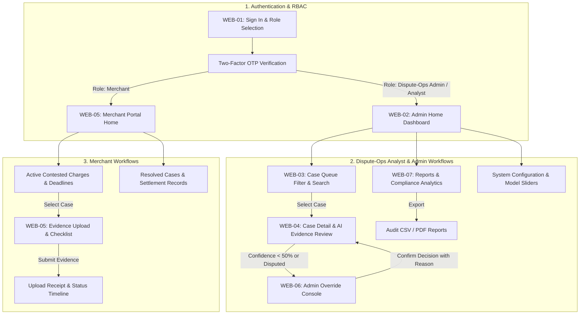

# 💻 VerdictAI: Merchant & Admin Web Console — UX Wireframes & Screen Architecture

> **Course:** IT644 — Application Development Group Project / Web Services & SOA  
> **Instructor:** Prof. JayPrakash Lalchandani  
> **Deliverable:** Phase 1 Deliverable #11 — Merchant & Dispute-Ops Admin Web Console UX Wireframes & Layout Architecture  
> **Lead / Author:** Rohit Peswani (`202512115`) — Frontend Engineer (Web — Admin/Merchant)  
> **Target Framework:** React 18 (TypeScript), Vite, TailwindCSS / Radix UI / Lucide Icons, Axios  
> **Repository Target:** `VerdictAI/frontend-web/`  

---

## 📌 1. Overview & Design Objectives

In legacy financial workflows, dispute and chargeback processing is fragmented across siloed CRM tools, spreadsheets, and manual email correspondence. Dispute analysts face cognitive overload from toggling between unstructured receipt images, carrier tracking manifests, and payment processor logs. Simultaneously, merchants suffer from opaque rejection notices and tight 48-hour submission windows without real-time feedback.

The **VerdictAI Web Console** serves two primary user personas—**Dispute-Ops Admins/Analysts** and **Merchants**—delivering a high-density, desktop-first workspace that emphasizes clarity, rapid operational turnaround, and explainability:

1. **Dual Persona Role-Based Views:** Tailored workspaces for internal Dispute-Ops analysts (queue management, AI score inspection, manual override, audit exports) and external merchants (dispute inbox, evidence checklist uploader, outcome tracking).
2. **Explainable AI (XAI) Transparency:** Prominent, non-technical plain-language reasoning cards alongside quantitative factor weights (0–100) generated by the fair-weighing scoring engine.
3. **Streamlined Evidence Ingestion:** High-speed drag-and-drop file ingestion (PDF, PNG, JPEG $\le$ 25 MB) with immediate visual feedback on parsing status (Auto-Parsed, Uploaded, Missing, In Review).
4. **Mandatory Audit Governance:** Strict audit trail preservation where every override, status transition, and comment requires structured justification and is recorded immutably.
5. **Accessibility & Usability (WCAG 2.1 AA):** Strict color contrast compliance ($\ge 4.5:1$), high-contrast badges, keyboard navigable forms, and sub-2-second data load latency.

---

## 🔄 2. Web User Journey & Navigation Architecture



---

## 🎨 3. Design System & Theme Token Specifications

The web console utilizes a disciplined, financial-grade design system emphasizing clarity, high information density, and low visual fatigue for dispute operations teams.

### 3.1 Color Palette & Semantic Tokens

| Category | Token Name | Hex Value | Usage / Description |
| :--- | :--- | :--- | :--- |
| **Primary** | `--color-navy-900` | `#0F172A` | Sidebar background, primary brand headers |
| **Primary Accent**| `--color-blue-600` | `#2563EB` | Active nav items, primary buttons, links |
| **Primary Hover** | `--color-blue-700` | `#1D4ED8` | Primary button hover state |
| **Background** | `--color-slate-50` | `#F8FAFC` | Main canvas workspace background |
| **Surface** | `--color-white` | `#FFFFFF` | Cards, panels, modal containers |
| **Border / Line** | `--color-slate-200` | `#E2E8F0` | Card borders, table dividers, inputs |
| **Text Primary** | `--color-slate-900` | `#0F172A` | Page headers, case IDs, primary values |
| **Text Secondary**| `--color-slate-500` | `#64748B` | Subtext, timestamps, metadata labels |
| **Success Badge** | `--badge-success` | `#10B981` / `#ECFDF5` | `AUTO-RESOLVED`, `Parsed`, `Won` |
| **Warning Badge** | `--badge-warning` | `#F59E0B` / `#FFFBEB` | `PENDING`, `Awaiting Evidence`, `48h SLA` |
| **Danger Badge** | `--badge-danger` | `#EF4444` / `#FEF2F2` | `ESCALATED`, `Not Found`, `Missing` |
| **Info Badge** | `--badge-info` | `#3B82F6` / `#EFF6FF` | `IN REVIEW`, `Uploaded by Member` |

### 3.2 Typography Hierarchy

- **Font Family:** `Inter`, `-apple-system`, `BlinkMacSystemFont`, `Segoe UI`, `Roboto`, `sans-serif`
- **Monospace (Code / Case IDs):** `JetBrains Mono`, `Fira Code`, `ui-monospace`
- **Scale:**
  - `Display / KPI`: 28px (Bold, Line Height: 34px)
  - `Heading 1 (Page Title)`: 22px (Semi-Bold, Line Height: 28px)
  - `Heading 2 (Card Title)`: 16px (Semi-Bold, Line Height: 24px)
  - `Body / Cell Text`: 14px (Regular, Line Height: 20px)
  - `Caption / Metadata`: 12px (Regular/Medium, Line Height: 16px)

### 3.3 Layout & Grid Rules

- **Target Viewport:** Desktop-first ($\ge 1024\text{px}$, optimized for $1440 \times 900\text{px}$ and $1920 \times 1080\text{px}$).
- **Sidebar Width:** Fixed 240px navy collapsible navigation drawer.
- **Header Height:** 64px sticky global top bar with user profile, organization switcher, and quick actions.
- **Content Area:** Fluid container with max-width $1600\text{px}$, padding $24\text{px}$.

---

## 🖥️ 4. Comprehensive Screen Catalog & Layout Architecture

### Screen WEB-01: Authentication — Login & Role Selection
Secure single sign-on entry point for Dispute-Ops analysts, system administrators, and merchant representatives.

```
+-----------------------------------------------------------------------+
|  ■ VerdictAI Console                      Transparent · Fast · Fair   |
|                                                                       |
|                     +---------------------------+                     |
|                     |          Sign In          |                     |
|                     | Access your dispute portal|                     |
|                     |                           |                     |
|                     | Role:                     |                     |
|                     | [Admin/Analyst] [Merchant]|                     |
|                     |                           |                     |
|                     | Email / Employee ID:      |                     |
|                     | [ you@organization.com  ] |                     |
|                     |                           |                     |
|                     | Password:                 |                     |
|                     | [ ****************    👁 ] |                     |
|                     |          Forgot password? |                     |
|                     |                           |                     |
|                     | [     Sign In  ->       ] |                     |
|                     |                           |                     |
|                     |  Secured by 2FA & TLS 1.3 |                     |
|                     +---------------------------+                     |
+-----------------------------------------------------------------------+
```

- **Key UI Elements:** Role toggle tab (`Admin/Analyst` vs `Merchant`), credential inputs with inline validation, 2FA prompt modal on submit, security compliance badge.
- **API Endpoints:** `POST /api/v1/auth/login`, `POST /api/v1/auth/verify-2fa`.
- **Frontend State:** Active role state, JWT token storage in secure HTTP-only cookies / memory session, redirect router based on claim.

---

### Screen WEB-02: Dispute-Ops Admin Home Dashboard
Central mission control for dispute operations analysts and management, surfacing real-time throughput metrics, SLA health, and the active prioritized case queue.


- **Key UI Components:**
  1. **Top KPI Summary Metrics:**
     - **Total Disputes:** `1,247` (Monthly aggregate volume).
     - **Pending Review:** `38` (Cases requiring active human review).
     - **Auto-Resolved:** `1,156` (92.7% straight-through processing rate).
     - **Escalated:** `53` (Low-confidence or policy edge-cases).
  2. **Active Case Queue Table:** Real-time paginated table displaying Case ID (`DSP-1041`), Card Member, Merchant (`Amazon IN`, `Swiggy`, `Flipkart`), Disputed Amount, Status Badge, AI Confidence Score, and Quick Action buttons (`Review`, `Override`, `View`).
  3. **Dispute Volume Chart:** 30-day chronological bar trend analyzing daily intake spikes.
  4. **Resolution Breakdown Doughnut:** Visual breakdown of auto-resolved vs. pending vs. escalated distribution.
- **API Mapping:** `GET /api/v1/admin/dashboard-stats`, `GET /api/v1/disputes?limit=6`.

---

### Screen WEB-03: Case Queue (List View & Advanced Multi-Filter)
High-density operational queue allowing analysts to filter, sort, search, and batch-triage dispute cases.

```
+----------------------------------------------------------------------------------------------------------+
| DisputeOps Admin               [ Search Case ID, Cardholder, Merchant... ]  | Admin User (Ops) | Logout  |
+----------------------------------------------------------------------------------------------------------+
| NAVIGATION     | Case Queue                                                                              |
| - Dashboard    | Filters: [ Status: All v ] [ Date: Last 30 Days v ] [ Amount: All v ] [ Score: All v ]  |
| > Case Queue   | Actions: [ Export CSV ] [ Batch Assign ]                                                |
| - Case Details +-----------------------------------------------------------------------------------------+
| - Evidence     | Case ID   | Filed Date  | Card Member  | Merchant    | Amount   | Category    | AI Score | Status     | Assignee  | Action   |
| - Override     | DSP-1041  | 22-Aug-2026 | Rahul Mehta  | Amazon IN   | ₹4,299   | Not Receive | 72%      | PENDING    | Analyst A | [Review] |
| - Reports      | DSP-1040  | 21-Aug-2026 | Priya Shah   | Swiggy      | ₹890     | Duplicate   | 91%      | AUTO-RES   | System    | [View]   |
| - Settings     | DSP-1039  | 21-Aug-2026 | Anil Kumar   | Flipkart    | ₹12,500  | Overcharge  | 44%      | ESCALATED  | Analyst B | [Override]|
|                | DSP-1038  | 20-Aug-2026 | Sneha Patel  | Zomato      | ₹340     | Duplicate   | 96%      | AUTO-RES   | System    | [View]   |
|                | DSP-1037  | 20-Aug-2026 | Vikram Roy   | MakeMyTrip  | ₹8,000   | Not Receive | 61%      | IN REVIEW  | Analyst A | [Review] |
|                | DSP-1036  | 19-Aug-2026 | Kavita Jain  | BookMyShow  | ₹600     | Duplicate   | 88%      | AUTO-RES   | System    | [View]   |
|                +-----------------------------------------------------------------------------------------+
|                | Showing 1–8 of 247 cases                     < Previous  [ 1 ] [ 2 ] [ 3 ]  Next >       |
+----------------------------------------------------------------------------------------------------------+
```

- **Key UI Elements:** Dynamic search bar (fuzzy matches Case ID or user names), multi-attribute filter chips, sortable column headers, pagination controls, CSV export button.
- **Performance Requirement:** Must load and filter up to 1,000 cases in under 2 seconds without full page refreshes (SRS UIR-02, AC-12).
- **API Mapping:** `GET /api/v1/disputes?status={}&category={}&page=1&limit=25`.

---

### Screen WEB-04: Case Detail & AI Evidence Review
In-depth diagnostic view synthesizing transaction metadata, parsed multi-modal evidence items, and explainable AI scoring outputs.


- **Key UI Components:**
  1. **Case Header & Breadcrumbs:** `Case Queue > DSP-1041`, prominent status tag (`PENDING REVIEW`).
  2. **Case Information Panel:** Card Member details (`Rahul Mehta, •••• 4821`), Merchant name (`Amazon India Pvt Ltd`), Transaction date, Disputed amount (`₹4,299`), and Dispute reason category (`Item Not Received`).
  3. **Multi-Source Collected Evidence Ledger:**
     - **Transaction Receipt:** Parsed successfully (`AUTO`, green badge).
     - **Delivery Tracking:** Not Found (`AUTO`, red badge).
     - **Merchant Response:** Uploaded (`MERCHANT`, blue badge).
     - **Order Screenshot:** Uploaded (`MEMBER`, blue badge).
  4. **AI Scoring Gauge & Factor Breakdown:**
     - Overall Score: **72%** (Recommendation: *Resolve in Member Favour*).
     - Factor breakdown indicators: *Delivery evidence missing (high weight)*, *Transaction receipt valid*, *Member history: clean*, *Merchant reply: partial*.
  5. **Explainable AI (XAI) Plain-Language Explanation:**
     - Dedicated visually isolated explanation card (SRS UIR-08) translating complex ML weights into plain English for both stakeholders:
       > *"The dispute was scored in favour of the card member. Key factor: no delivery confirmation was found in carrier data for order #OD112344567. The merchant provided a partial response but did not submit tracking proof. The transaction receipt is valid and the card member's account has no prior dispute history."*
  6. **Operator Action Controls:** `[Approve Recommendation]`, `[Override Decision]`, `[Escalate for Human Review]`.
- **API Mapping:** `GET /api/v1/disputes/{case_id}`, `GET /api/v1/evidence/{case_id}`, `POST /api/v1/disputes/{case_id}/actions`.

---

### Screen WEB-05: Merchant Portal — Active Disputes & Evidence Submission
Dedicated self-service hub empowering merchants to track dispute deadlines and furnish required proof before the 48-hour SLA window expires.


- **Key UI Components:**
  1. **Merchant Metric Overview:** Open Disputes (`7`), Awaiting Evidence (`3`), Won Cases (`142`), Lost Cases (`38`).
  2. **Disputes Requiring Evidence (Deadline Approaching):**
     - Case table highlighting urgent deadlines (`DSP-1041`, `DSP-1039`, `DSP-1033`).
     - Evidence status indicators (`PENDING UPLOAD`, `PARTIAL`).
  3. **Structured Evidence Submission Modal / Section:**
     - Interactive checklist:
       - `Transaction Invoice / Receipt` (Uploaded checkmark).
       - `Shipping / Tracking Confirmation` (Required tag).
       - `Customer Communication Log` (Required tag).
       - `Delivery Proof / Photo` (Required tag).
     - **Drag & Drop Upload Zone:** Supporting PDF, JPG, PNG up to 25MB per file with immediate client-side validation.
     - Optional merchant explanatory statement input field.
- **API Mapping:** `GET /api/v1/merchant/disputes`, `POST /api/v1/evidence/upload`.

---

### Screen WEB-06: Admin Override Console
Financial-grade governance interface enabling authorized analysts and administrators to overturn automated recommendations with mandatory auditing.


- **Key UI Components:**
  1. **Case Header & Alert:** Case `DSP-1039`, warning banner explaining why manual review was triggered (*AI Score Low: 44% — Escalated for Admin Override*).
  2. **AI Evidence Factor Summary:**
     - Horizontal progress bars detailing weighted sub-scores:
       - *Merchant submitted tracking proof*: `85%`
       - *Amount discrepancy logged*: `65%`
       - *Card member history (2 prior disputes)*: `45%`
       - *Communication log (inconclusive)*: `30%`
  3. **Manual Override Decision Form:**
     - Radio group options:
       - 🔘 `Favour Card Member`
       - 🔘 `Favour Merchant`
       - 🔘 `Split Decision`
       - 🔘 `Request More Evidence`
     - **Mandatory Override Reason:** Textarea with client-side required validation (form submission blocked if empty per SRS AC-13).
     - Action CTAs: `[Confirm Override]` (green button) and `[Cancel]`.
  4. **Immutable Audit Trail:** Chronological log showing system and user events with micro-second timestamps:
     - *22 Aug 10:34 — System: Case created*
     - *22 Aug 10:35 — System: Evidence parsed — tracking record not found*
     - *22 Aug 10:36 — AI Model: Score computed: 44% (escalated)*
     - *22 Aug 11:02 — Merchant: Evidence uploaded*
     - *22 Aug 12:15 — Analyst B: Assigned for manual review*
- **API Mapping:** `POST /api/v1/admin/override`, `GET /api/v1/audit/logs/{case_id}`.

---

### Screen WEB-07: Reports & Compliance Analytics
Comprehensive executive and compliance reporting dashboard displaying platform throughput, win rates, and audit export capabilities.


- **Key UI Components:**
  1. **Date Range & Filter Bar:** `From date`, `To date`, `Category filter`, `Apply` and `Export PDF` buttons.
  2. **Platform KPI Performance Cards:**
     - **Avg Resolution Time:** `4.2 min` (vs. 2–6 weeks industry standard).
     - **Auto-Resolution Rate:** `92.7%` (straight-through automation).
     - **False Positive Rate:** `1.3%` (well within < 2% target per NFR-14).
     - **Merchant Win Rate:** `38%` (unbiased, balanced adjudication).
  3. **Monthly Dispute Intake Trends:** Visual multi-month bar chart (March – August).
  4. **Dispute Category Distribution:** Breakdown of claims (*Not Received 42%*, *Duplicate Charge 28%*, *Wrong Amount 18%*, *Defective Item 12%*).
  5. **Recent Audit Exports Table:** Downloadable PDF/CSV compliance reports with generator identity, record count, and download CTAs.
- **API Mapping:** `GET /api/v1/admin/reports/summary`, `GET /api/v1/admin/reports/export`.

---

## 🏛️ 5. React Component Hierarchy Tree

To maintain strict separation of concerns, modular reusability, and rapid rendering, the web frontend is organized into the following component architecture:

```
VerdictAI Web Console (React 18)
├── App.tsx (React Router v6 + AuthProvider + ThemeProvider)
│   ├── Layout/
│   │   ├── NavigationSidebar.tsx (Navy #0F172A, Role-Aware Routes, Collapsible)
│   │   ├── GlobalHeader.tsx (User Profile, Notifications Bell, Role Badge, Logout)
│   │   └── MainContentContainer.tsx (Fluid 1600px Max-Width Canvas)
│   │
│   ├── pages/
│   │   ├── LoginPage.tsx (Role Selector, Email/Password, 2FA Modal)
│   │   ├── AdminDashboardPage.tsx (KPI Cards, Volume Bar Chart, Active Queue Table)
│   │   ├── CaseQueuePage.tsx (Advanced Filter Bar, Paginated Case Table, Quick Actions)
│   │   ├── CaseDetailPage.tsx (Metadata Grid, Evidence List, Score Gauge, XAI Card)
│   │   ├── OverrideConsolePage.tsx (Factor Progress Bars, Form Radios, Audit Trail)
│   │   ├── MerchantPortalPage.tsx (Deadline Countdown, Active Disputes, Status Cards)
│   │   ├── ReportsAnalyticsPage.tsx (Summary Strip, Category Breakdown, Export Table)
│   │   └── NotFoundPage.tsx (Empty State, Clear Return CTA)
│   │
│   └── components/
│       ├── common/
│       │   ├── StatusBadge.tsx (WCAG 2.1 AA Compliant Color-coded Pill)
│       │   ├── ScoreGauge.tsx (0–100 SVG Radial Chart with Animated Fill)
│       │   ├── DataTable.tsx (Generic Paginated, Sortable, Client-Side Filterable)
│       │   ├── DateRangePicker.tsx (Custom Range Preset Selector)
│       │   └── ConfirmModal.tsx (Accessible Dialog with Focus Trap)
│       ├── evidence/
│       │   ├── EvidenceChecklist.tsx (Required vs Optional Document Slots)
│       │   ├── DragDropUploader.tsx (Drag-and-Drop, 25MB Cap Validation, Progress Bar)
│       │   └── DocumentPreviewModal.tsx (Inline PDF/Image Lightbox Viewer)
│       ├── explainability/
│       │   ├── XAIExtendedCard.tsx (Visually Separated Plain-Language Box)
│       │   └── FactorWeightBar.tsx (Relative Weight Percentage Bar with Tooltip)
│       └── audit/
│           ├── AuditTimeline.tsx (Vertical Hash-Chained Event Feed)
│           └── CryptographicBadge.tsx (SHA-256 Hash Verification Indicator)
```

---

## 📋 6. SRS Functional Requirements & Acceptance Criteria Alignment

| SRS Req / AC | Requirement Description | Web Wireframe Implementation | Target REST API Endpoint |
| :--- | :--- | :--- | :--- |
| **FR-01, FR-02** | Role-based authentication & mandatory 2FA for Admin/Merchant | Screen WEB-01: Sign In tab with 2FA verification modal | `POST /api/v1/auth/login` |
| **FR-25, AC-12** | Paginated case queue with filters, sub-2s client-side load | Screen WEB-02 & WEB-03: Filterable case queue | `GET /api/v1/disputes` |
| **FR-26** | Full case file view, AI score breakdown, and XAI rationale | Screen WEB-04: Metadata panel, score gauge & XAI card | `GET /api/v1/disputes/{id}` |
| **FR-27, AC-13** | Admin override with mandatory written reason blocking | Screen WEB-06: Form radio group with validated textarea | `POST /api/v1/admin/override` |
| **FR-29, AC-15** | Exportable compliance audit reports (PDF/CSV) < 30s | Screen WEB-07: Export controls with CSV/PDF generator | `GET /api/v1/admin/reports/export` |
| **FR-22, FR-24** | Real-time status tracking & merchant deadline countdowns | Screen WEB-05: Disputes requiring evidence with countdown | `GET /api/v1/merchant/disputes` |
| **UIR-04** | WCAG 2.1 AA compliant contrast ratios ($\ge 4.5:1$) | Section 3.1: Curated accessible palette token spec | Frontend Design Tokens |
| **UIR-06** | Drag-and-drop file upload with progress and 25MB limit | Screen WEB-05: Drag & drop uploader with size validation | `POST /api/v1/evidence/upload` |
| **UIR-08** | Plain-language explanation in visually distinct panel | Screen WEB-04: Dedicated highlighted blue container | `GET /api/v1/disputes/{id}/rationale` |

---

## 🚀 7. Next Implementation Steps (Phase 4 Engineering Roadmap)

1. **React Application Scaffold (`VerdictAI/frontend-web/`):**
   - Initialize Vite + React 18 + TypeScript build environment.
   - Configure TailwindCSS with design tokens defined in Section 3.1 (`navy-900`, `blue-600`, semantic status badges).
   - Set up React Router v6 with protected route guards for `Admin/Analyst` and `Merchant` roles.
2. **Design System Component Implementation:**
   - Build foundational components (`StatusBadge`, `ScoreGauge`, `DataTable`, `DragDropUploader`, `XAIExtendedCard`).
   - Implement strict client-side validation schemas (Zod) for file size limits and mandatory override reason fields.
3. **API Integration & State Management:**
   - Configure Axios client with JWT interceptor and token auto-refresh.
   - Wire Case Queue and Case Detail views to backend REST endpoints (`/api/v1/disputes`, `/api/v1/evidence`, `/api/v1/admin`).
