# 💻 VerdictAI: Merchant & Admin Web Console — UX Wireframes & Screen Architecture

> **Course:** IT644 — Application Development Group Project / Web Services & SOA  
> **Instructor:** Prof. JayPrakash Lalchandani  
> **Deliverable:** Phase 1 Deliverable #11 — Merchant & Dispute-Ops Admin Web Console UX Wireframes & Layout Architecture  
> **Lead / Author:** Rohit Peswani (`202512115`) — Frontend Engineer (Web — Admin/Merchant)  
> **Target Framework:** React 18 (TypeScript), Vite, TailwindCSS / Radix UI / Lucide Icons, Axios  
> **Repository Target:** `VerdictAI/frontend-web/` & `VerdictAI/web-app/`  

---

## 📌 1. Overview & Design Objectives

In legacy financial workflows, dispute and chargeback processing is fragmented across siloed CRM tools, spreadsheets, and manual email correspondence. Dispute analysts face cognitive overload from toggling between unstructured receipt images, carrier tracking manifests, and payment processor logs. Simultaneously, merchants suffer from opaque rejection notices and tight 48-hour submission windows without real-time feedback.

The **VerdictAI Web Console** serves two primary user personas—**Dispute-Ops Admins/Analysts** and **Merchants**—delivering a high-density, desktop-first workspace that emphasizes clarity, rapid operational turnaround, and explainability:

1. **Dual Persona Role-Based Views:** Dedicated workspaces for internal Dispute-Ops analysts (queue management, NLP entity verification, AI score inspection, manual override, system configuration, audit exports) and external merchants (dispute inbox, evidence checklist uploader, recovery analytics, integration settings).
2. **Explainable AI (XAI) Transparency:** Prominent, non-technical plain-language reasoning cards alongside quantitative factor weights (0–100) generated by the fair-weighing scoring engine.
3. **Structured NLP Evidence Verification:** Side-by-side comparison tables evaluating cardholder claims against merchant records with visual match/discrepancy indicators.
4. **Streamlined Evidence Ingestion:** High-speed drag-and-drop file ingestion (PDF, PNG, JPEG $\le$ 25 MB) with immediate visual feedback on parsing status (Auto-Parsed, Uploaded, Missing, In Review).
5. **Mandatory Audit Governance:** Strict audit trail preservation where every override, status transition, and configuration adjustment requires structured justification and is recorded immutably.
6. **Accessibility & Usability (WCAG 2.1 AA):** Strict color contrast compliance ($\ge 4.5:1$), high-contrast badges, keyboard navigable forms, and sub-2-second data load latency.

---

## 🔄 2. Web User Journey & Navigation Architecture

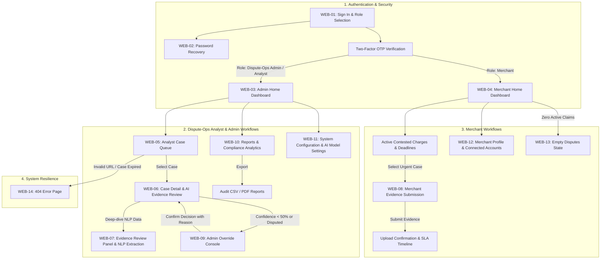
```mermaid
flowchart TD
    subgraph AuthPortal["1. Authentication & Security"]
        L[WEB-01: Sign In & Role Selection] --> PWD[WEB-02: Password Recovery]
        L --> 2FA[Two-Factor OTP Verification]
        2FA -->|Role: Dispute-Ops Admin / Analyst| A_Home[WEB-03: Admin Home Dashboard]
        2FA -->|Role: Merchant| M_Home[WEB-04: Merchant Home Dashboard]
    end

    subgraph AdminWorkflows["2. Dispute-Ops Analyst & Admin Workflows"]
        A_Home --> Q[WEB-05: Analyst Case Queue]
        Q -->|Select Case| D[WEB-06: Case Detail & AI Evidence Review]
        D -->|Deep-dive NLP Data| E_Rev[WEB-07: Evidence Review Panel & NLP Extraction]
        D -->|Confidence < 50% or Disputed| O[WEB-09: Admin Override Console]
        O -->|Confirm Decision with Reason| D
        A_Home --> R[WEB-10: Reports & Compliance Analytics]
        R -->|Export| EXP[Audit CSV / PDF Reports]
        A_Home --> S[WEB-11: System Configuration & AI Model Settings]
    end

    subgraph MerchantWorkflows["3. Merchant Workflows"]
        M_Home --> M_Active[Active Contested Charges & Deadlines]
        M_Active -->|Select Urgent Case| M_Upload[WEB-08: Merchant Evidence Submission]
        M_Upload -->|Submit Evidence| M_Conf[Upload Confirmation & SLA Timeline]
        M_Home --> M_Prof[WEB-12: Merchant Profile & Connected Accounts]
        M_Home -->|Zero Active Claims| M_Empty[WEB-13: Empty Disputes State]
    end

    subgraph ErrorHandling["4. System Resilience"]
        Q -->|Invalid URL / Case Expired| ERR[WEB-14: 404 Error Page]
    end
```

---

## 🎨 3. Design System & Theme Token Specifications

The web console utilizes a disciplined, financial-grade design system emphasizing clarity, high information density, and low visual fatigue for dispute operations teams.

### 3.1 Color Palette & Semantic Tokens

| Category | Token Name | Hex Value | Usage / Description |
| :--- | :--- | :--- | :--- |
| **Primary** | `--color-navy-900` | `#0F172A` | Sidebar background, primary brand headers |
| **Primary Accent**| `--color-blue-600` | `#2563EB` | Active nav items, primary buttons, links |
| **Primary Hover** | `--color-blue-700` | `#1D4ED8` | Primary button hover state |
| **Background** | `--color-slate-50` | `#F8FAFC` | Main canvas workspace background |
| **Surface** | `--color-white` | `#FFFFFF` | Cards, panels, modal containers |
| **Border / Line** | `--color-slate-200` | `#E2E8F0` | Card borders, table dividers, inputs |
| **Text Primary** | `--color-slate-900` | `#0F172A` | Page headers, case IDs, primary values |
| **Text Secondary**| `--color-slate-500` | `#64748B` | Subtext, timestamps, metadata labels |
| **Success Badge** | `--badge-success` | `#10B981` / `#ECFDF5` | `AUTO-RESOLVED`, `Parsed`, `Won`, `Matched` |
| **Warning Badge** | `--badge-warning` | `#F59E0B` / `#FFFBEB` | `PENDING`, `Awaiting Evidence`, `48h SLA` |
| **Danger Badge** | `--badge-danger` | `#EF4444` / `#FEF2F2` | `ESCALATED`, `Not Found`, `Missing`, `Discrepancy` |
| **Info Badge** | `--badge-info` | `#3B82F6` / `#EFF6FF` | `IN REVIEW`, `Uploaded by Member` |

### 3.2 Typography Hierarchy

- **Font Family:** `Inter`, `-apple-system`, `BlinkMacSystemFont`, `Segoe UI`, `Roboto`, `sans-serif`
- **Monospace (Code / Case IDs / Checksums):** `JetBrains Mono`, `Fira Code`, `ui-monospace`
- **Scale:**
  - `Display / KPI`: 28px (Bold, Line Height: 34px)
  - `Heading 1 (Page Title)`: 22px (Semi-Bold, Line Height: 28px)
  - `Heading 2 (Card Title)`: 16px (Semi-Bold, Line Height: 24px)
  - `Body / Cell Text`: 14px (Regular, Line Height: 20px)
  - `Caption / Metadata`: 12px (Regular/Medium, Line Height: 16px)

### 3.3 Layout & Grid Rules

- **Target Viewport:** Desktop-first ($\ge 1024\text{px}$, optimized for $1440 \times 900\text{px}$ and $1920 \times 1080\text{px}$).
- **Sidebar Width:** Fixed 240px navy collapsible navigation drawer (`#0F172A`).
- **Header Height:** 64px sticky global top bar with notification drawer, date presets, and user profile switcher.
- **Content Canvas:** Fluid grid layout with responsive max-width ($1600\text{px}$) and $24\text{px}$ gutter padding.

---

## 🖥️ 4. Comprehensive Screen Catalog & Layout Architecture (14 Screens)

---

### Screen WEB-01: Authentication — Login & Role Selection
Secure single sign-on entry point providing multi-tenant access control for dispute investigators, merchants, and operations staff.

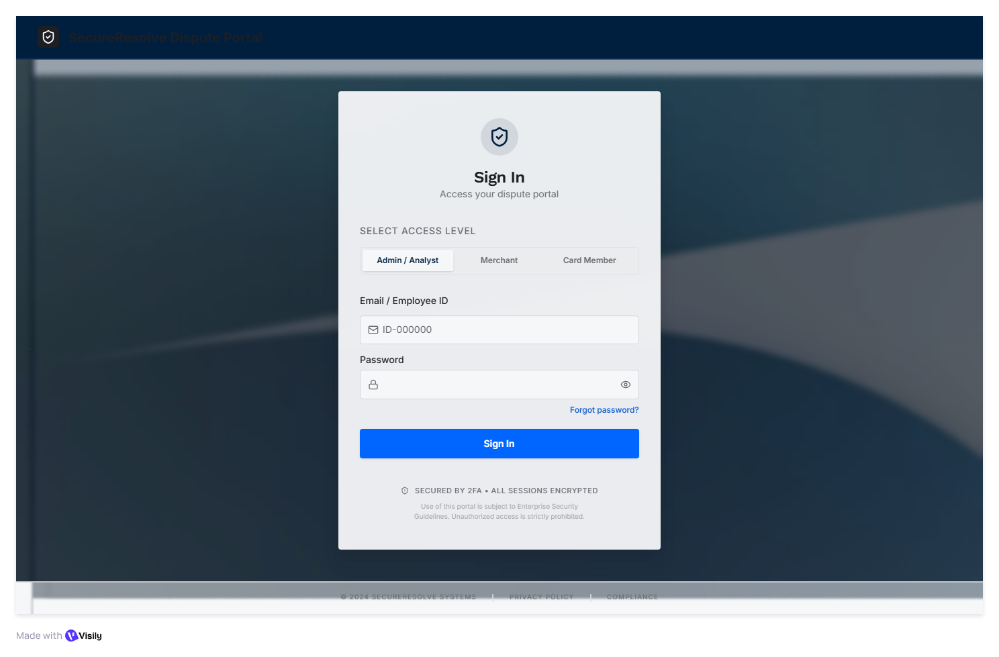

- **Key UI Elements:**
  - Segmented role picker tab (`Admin / Analyst`, `Merchant`, `Card Member`).
  - Input field for Email or Employee ID with icon prefix (`ID-000000`).
  - Password input field with interactive visibility toggle (eye icon).
  - Quick action link: *"Forgot password?"* directing to Screen WEB-02.
  - Primary CTA button: `[Sign In]`.
  - Security reassurance footer: *"SECURED BY 2FA • ALL SESSIONS ENCRYPTED"* referencing enterprise security guidelines.
- **API Mapping:** `POST /api/v1/auth/login`, `POST /api/v1/auth/verify-2fa`.
- **SRS Alignment:** FR-01, FR-02, FR-05, UIR-01.

---

### Screen WEB-02: Password Recovery & Account Reset
Guided multi-step credential recovery workflow with OTP verification for locked or forgotten merchant and analyst credentials.

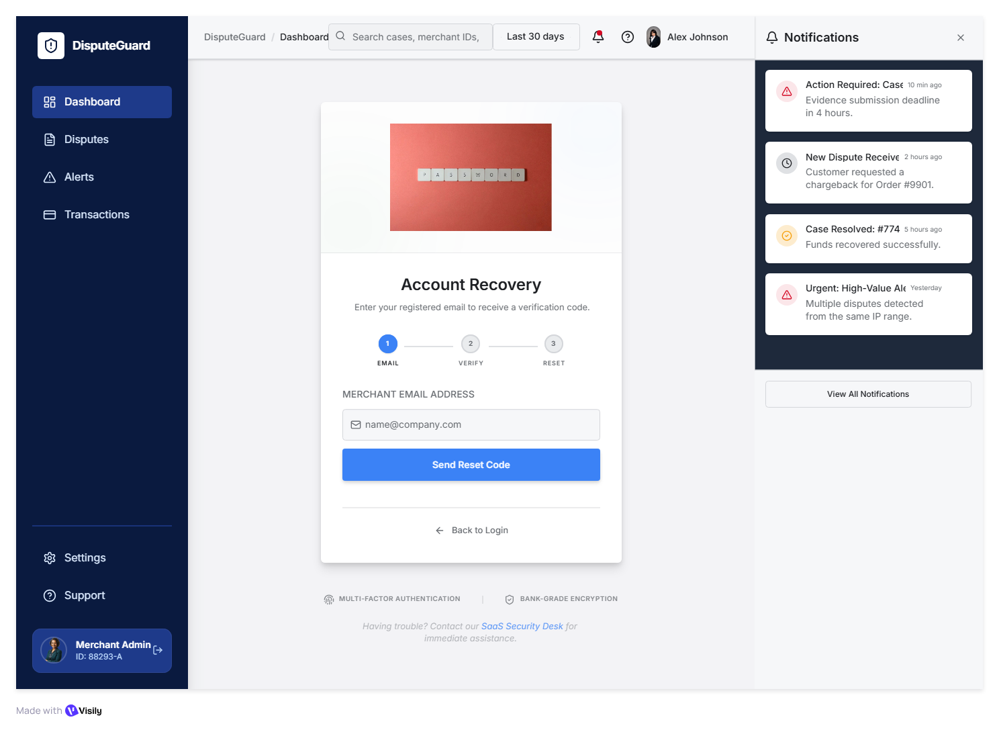

- **Key UI Elements:**
  - Branded card container with graphic header.
  - Step progression indicator: `1. EMAIL` $\rightarrow$ `2. VERIFY` $\rightarrow$ `3. RESET`.
  - Merchant / Operator email address input with inline format validation.
  - Primary CTA button: `[Send Reset Code]`.
  - Secondary navigation: `[<- Back to Login]`.
  - Right-side notification drawer displaying live security notifications and SLA deadline warnings.
  - Security footer: Multi-factor authentication & bank-grade encryption indicators.
- **API Mapping:** `POST /api/v1/auth/forgot-password`, `POST /api/v1/auth/reset-password`.
- **SRS Alignment:** Section 8 Auth (Forgot Password), NFR-06.

---

### Screen WEB-03: Dispute-Ops Admin Home Dashboard
Central operational cockpit for dispute operations managers and senior reviewers, surfacing real-time throughput metrics and SLA risk queues.

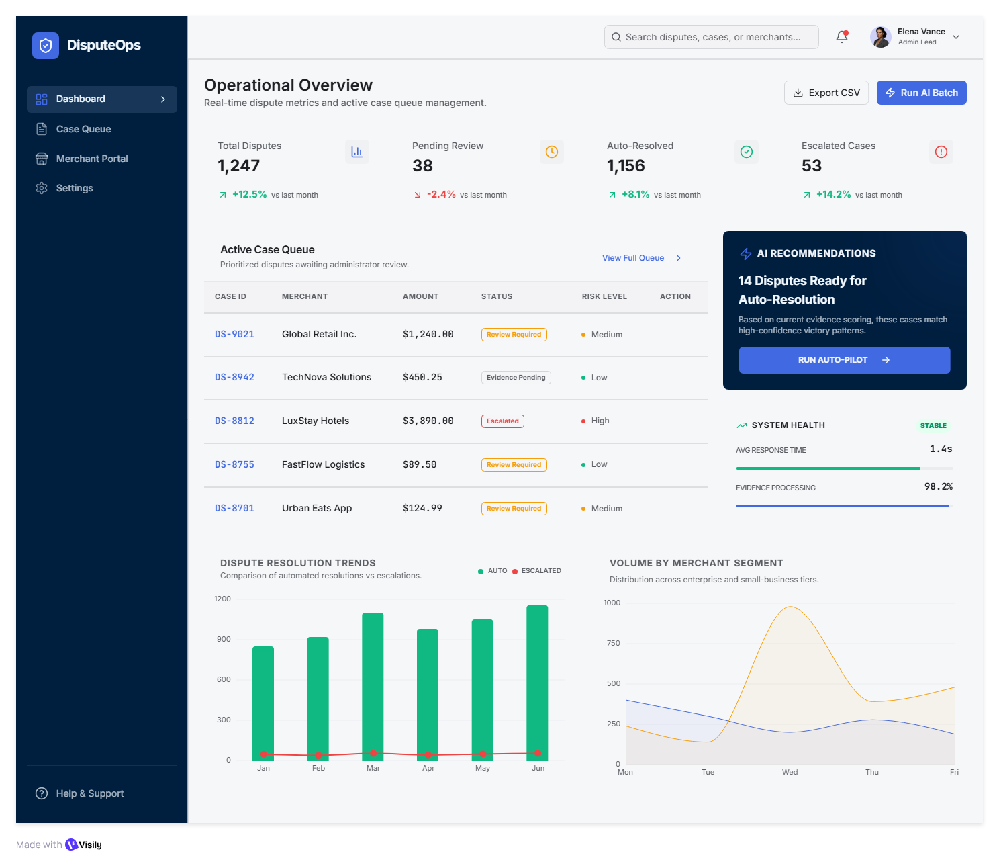

- **Key UI Elements:**
  - **4 Top KPI Metric Cards:**
    - **Total Disputes:** `1,247` (+12.5% vs last month).
    - **Pending Review:** `38` (-2.4% vs last month).
    - **Auto-Resolved:** `1,156` (+8.1% straight-through processing).
    - **Escalated Cases:** `53` (+14.2% low-confidence/edge-cases).
  - **Active Case Queue Table:** Paginated queue with columns for Case ID (`DS-9021`), Merchant (`Global Retail Inc.`), Amount (`$1,240.00`), Status Badge (`Review Required`), Risk Level (`Medium`), and inline action links.
  - **AI Recommendations Card:** Highlights cases eligible for straight-through automated batch resolution with `[RUN AUTO-PILOT ->]` button.
  - **System Health Monitor:** Real-time gauges for average response time (`1.4s`) and evidence processing rate (`98.2%`).
  - **Interactive Visualizations:** Monthly Dispute Resolution Trends (bar chart comparing Auto vs. Escalated) and Volume by Merchant Segment spline chart.
- **API Mapping:** `GET /api/v1/admin/dashboard-stats`, `GET /api/v1/disputes?limit=6`.
- **SRS Alignment:** FR-25, UIR-02, NFR-03.

---

### Screen WEB-04: Merchant Home Dashboard
Dispute portfolio overview for merchants to monitor active chargeback liabilities, imminent response deadlines, and recovery performance.

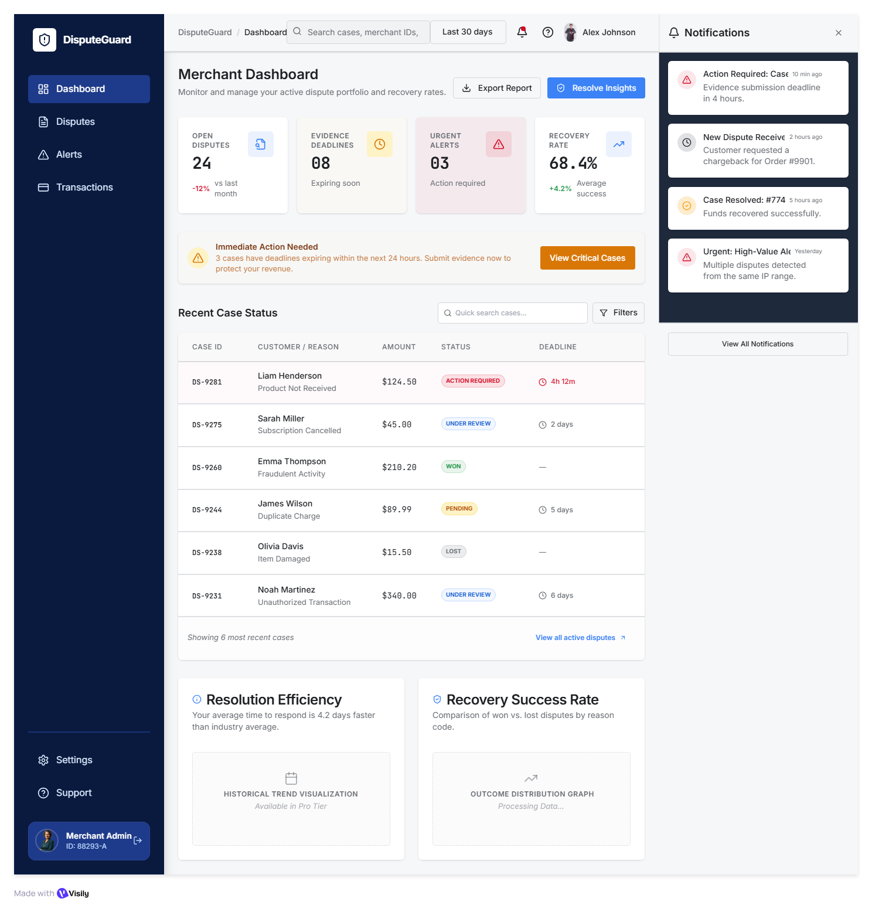

- **Key UI Elements:**
  - **4 Top Merchant Metric Cards:**
    - **Open Disputes:** `24` (-12% vs last month).
    - **Evidence Deadlines:** `08` (Expiring soon).
    - **Urgent Alerts:** `03` (Action required).
    - **Recovery Rate:** `68.4%` (+4.2% average win rate).
  - **Immediate Action Alert Banner:** Amber warning highlighting claims expiring within 24 hours with `[View Critical Cases]` CTA.
  - **Recent Case Status Table:** Displays customer name, dispute reason, amount, status pill (`ACTION REQUIRED`, `UNDER REVIEW`, `WON`, `PENDING`, `LOST`), and remaining response countdown (e.g., `4h 12m`, `2 days`, `5 days`).
  - **Analytical Widgets:** Resolution Efficiency (response turnaround vs. industry benchmark) and Recovery Success Rate breakdown.
- **API Mapping:** `GET /api/v1/merchant/dashboard-stats`, `GET /api/v1/merchant/disputes`.
- **SRS Alignment:** FR-22, FR-24, US-MR-01.

---

### Screen WEB-05: Analyst Case Queue (List View & Multi-Filter)
High-density dispute intake and triage queue engineered for rapid searching, multi-criteria filtering, and batch operations.

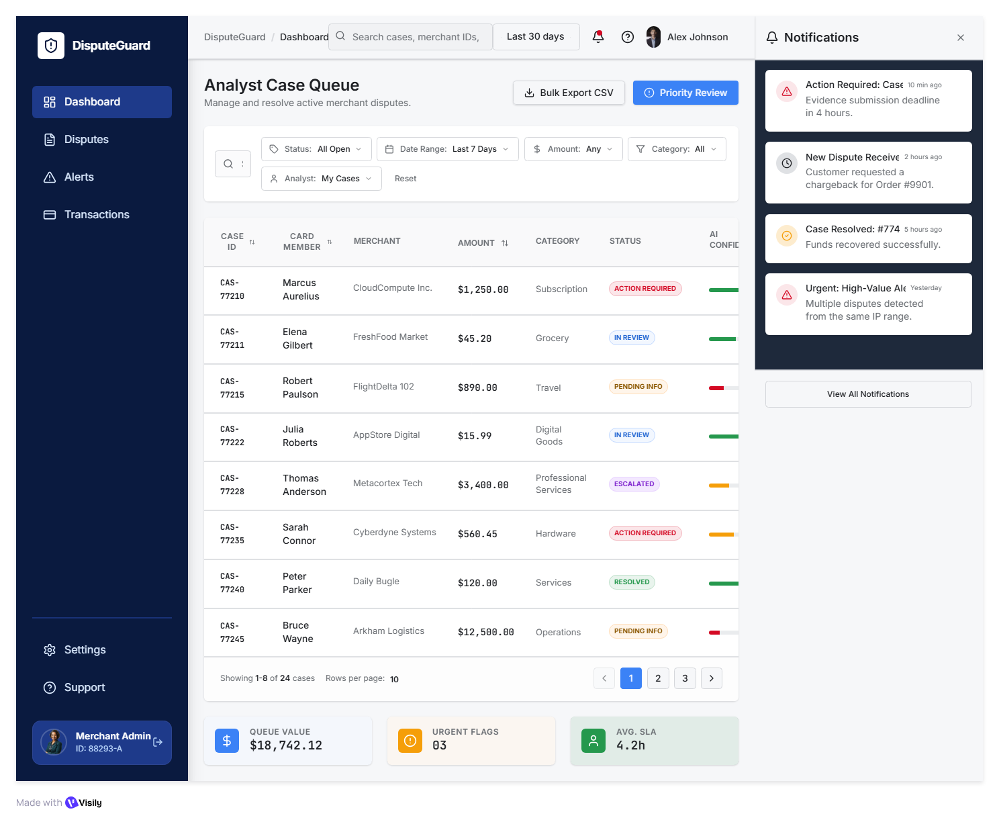

- **Key UI Elements:**
  - **Advanced Multi-Filter Toolbar:**
    - Status dropdown (`All Open`, `Action Required`, `In Review`, `Escalated`, `Resolved`).
    - Date Range selector (`Last 7 Days`, `Last 30 Days`).
    - Amount range filter (`Any`, `< $100`, `$100 - $1000`, `> $1000`).
    - Category dropdown (`All`, `Subscription`, `Grocery`, `Travel`, `Digital Goods`, `Hardware`).
    - Analyst assignment filter (`My Cases`, `Unassigned`).
  - **Batch Actions:** `[Bulk Export CSV]` and `[Priority Review]` trigger buttons.
  - **Data Table:** Sortable columns for Case ID, Card Member, Merchant, Amount, Category, Status, and AI Confidence indicator bar.
  - **Bottom Summary KPIs:** Queue Value (`$18,742.12`), Urgent Flags (`03`), and Average SLA (`4.2h`).
- **API Mapping:** `GET /api/v1/disputes`, `GET /api/v1/admin/queue-stats`.
- **SRS Alignment:** FR-25, AC-12, UIR-07.

---

### Screen WEB-06: Case Detail & AI Evidence Review
Deep-dive operational view synthesizing case metadata, cardholder statements, merchant profiles, auto-parsed evidence, and AI scoring intelligence.

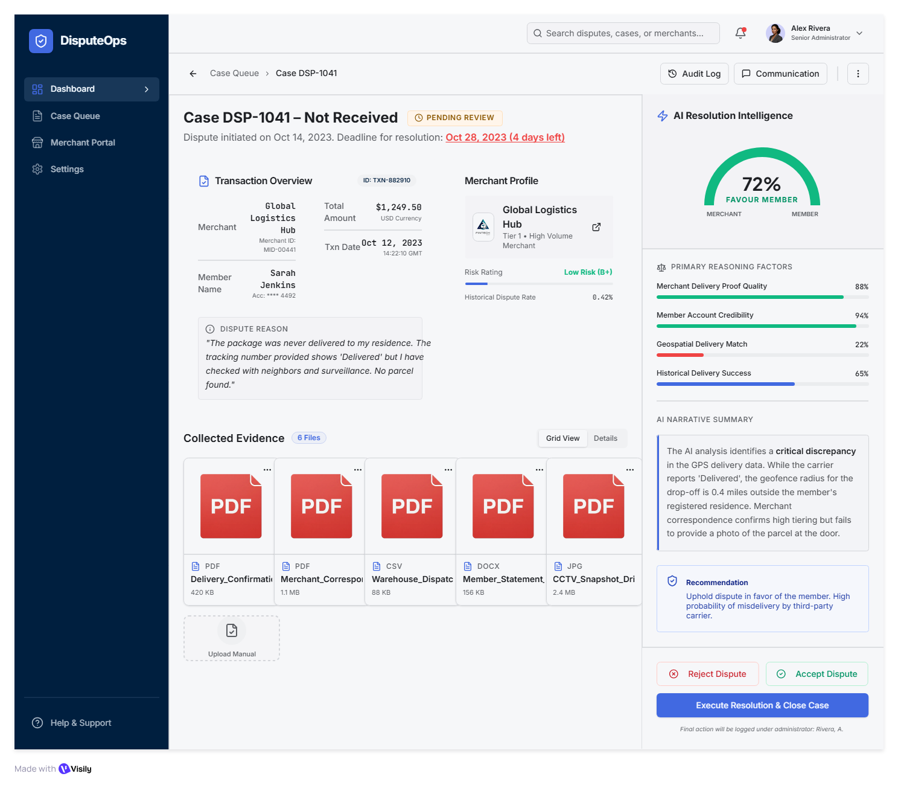

- **Key UI Elements:**
  - **Case Header:** Case ID (`DSP-1041 – Not Received`), status badge (`PENDING REVIEW`), and red deadline alert (*Oct 28, 2023 - 4 days left*).
  - **Transaction Overview Card:** Merchant ID, total disputed sum (`$1,249.50`), member account (`**** 4492`), and customer dispute quote box.
  - **Merchant Profile Card:** Tier 1 status, risk rating (`Low Risk B+`), and historical dispute frequency (`0.42%`).
  - **Collected Evidence Grid:** Card representation of uploaded documents (`Delivery_Confirmation.pdf`, `Merchant_Correspondence.pdf`, `Warehouse_Dispatch.csv`, `Member_Statement.docx`, `CCTV_Snapshot_Driveway.jpg`) with file badges and `[+ Upload Manual]` slot.
  - **AI Resolution Intelligence Panel:**
    - **Radial Semi-Circle Gauge:** Calibrated confidence rating (`72% FAVOUR MEMBER`).
    - **Primary Reasoning Factors:** Percentage progress bars for delivery proof quality (`88%`), member credibility (`94%`), geospatial delivery match (`22%`), and historical success (`65%`).
    - **Plain-Language Narrative Summary:** Visually separated panel translating ML weights into human-readable English.
    - **Operator Action Bar:** `[Reject Dispute]`, `[Accept Dispute]`, and `[Execute Resolution & Close Case]`.
- **API Mapping:** `GET /api/v1/disputes/{id}`, `GET /api/v1/evidence/{id}`, `GET /api/v1/disputes/{id}/rationale`.
- **SRS Alignment:** FR-15, FR-16, FR-19, FR-20, FR-26, UIR-08.

---

### Screen WEB-07: Evidence Review Interface & NLP Extraction Summary
Side-by-side evidence parsing interface comparing Card Member submissions against Merchant counter-records with automated NLP entity extraction.

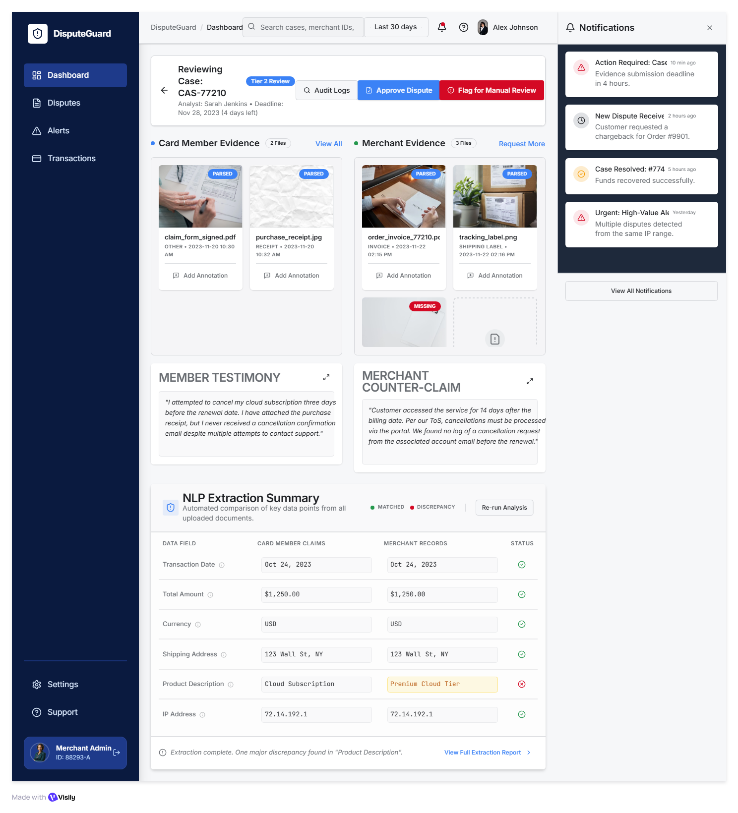

- **Key UI Elements:**
  - **Case Review Header:** `Reviewing Case: CAS-77210` with Tier 2 Review tag, `[Audit Logs]`, `[Approve Dispute]`, and `[Flag for Manual Review]` actions.
  - **Dual-Sided Evidence Galleries:**
    - **Card Member Evidence (2 Files):** `claim_form_signed.pdf` (`PARSED`), `purchase_receipt.jpg` (`PARSED`).
    - **Merchant Evidence (3 Files):** `order_invoice_77210.pdf` (`PARSED`), `tracking_label.png` (`PARSED`), and missing document placeholder (`MISSING`).
    - Interactive `[+ Add Annotation]` buttons on all evidence cards.
  - **Testimony Comparison Cards:** Side-by-side quotes comparing the Member Testimony against the Merchant Counter-Claim.
  - **NLP Extraction Summary Table:**
    - Automated comparison grid with status checkmarks and discrepancy badges.
    - Rows: `Transaction Date`, `Total Amount`, `Currency`, `Shipping Address`, `Product Description` (highlighting discrepancy between *"Cloud Subscription"* and *"Premium Cloud Tier"*), and `IP Address`.
    - Discrepancy callout footer with link to `View Full Extraction Report >`.
- **API Mapping:** `GET /api/v1/evidence/{id}/parsed`, `POST /api/v1/evidence/{id}/annotations`.
- **SRS Alignment:** FR-11, FR-12, FR-13, US-AD-02.

---

### Screen WEB-08: Merchant Portal — Active Disputes & Evidence Submission
Self-service evidence compilation and submission module enabling merchants to upload required proofs within the 48-hour SLA deadline.

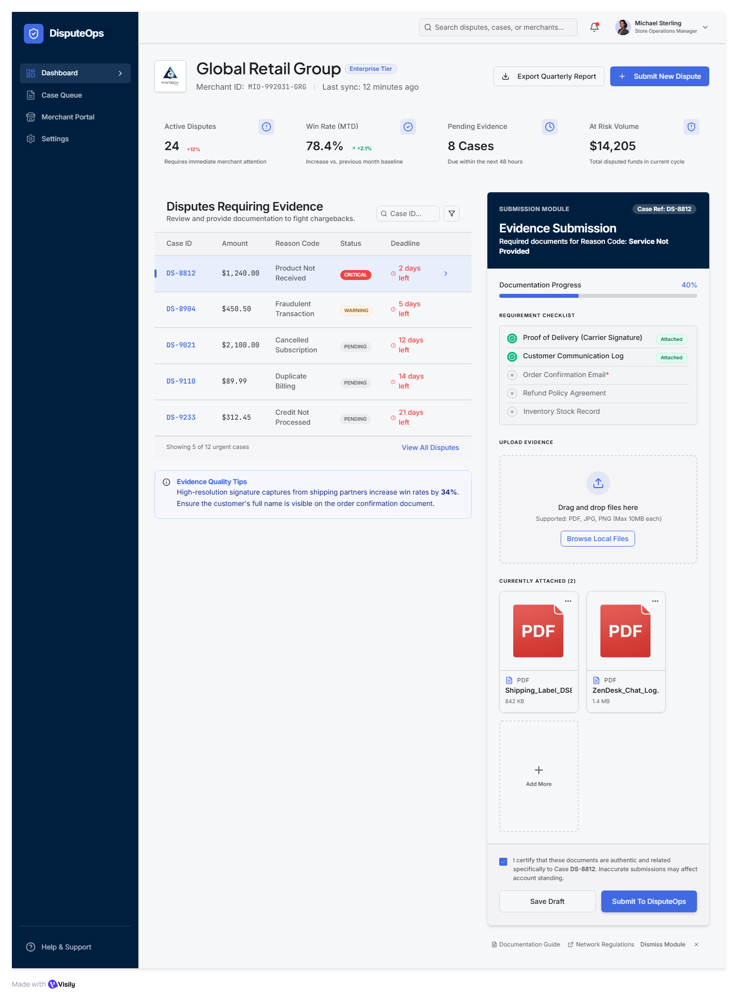

- **Key UI Elements:**
  - **Active Disputes Worklist:** Table with dispute urgency badges (`CRITICAL: 2 days left`, `WARNING: 5 days left`).
  - **Submission Module (Case DS-8812):**
    - Documentation completion progress bar (`40%`).
    - Requirement checklist: Proof of delivery, customer chat log, order confirmation email, refund policy agreement, and stock records.
    - **Drag & Drop Upload Zone:** Client-side validated file drop area supporting PDF, JPG, PNG up to 10MB/25MB per file.
    - **Currently Attached File List:** File cards with size and remove/preview options.
    - Legal certification checkbox acknowledging submission accuracy.
    - CTAs: `[Save Draft]` and `[Submit To DisputeOps]`.
- **API Mapping:** `GET /api/v1/merchant/disputes`, `POST /api/v1/evidence/upload`.
- **SRS Alignment:** FR-14, FR-24, US-MR-02, UIR-06.

---

### Screen WEB-09: Admin Override Console
Audited override console allowing senior dispute investigators to overturn automated model decisions with mandatory justification logging.

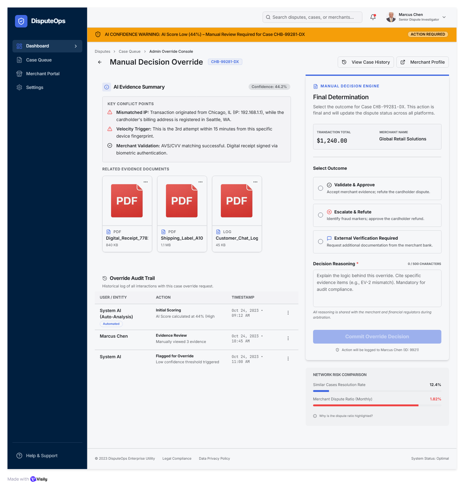

- **Key UI Elements:**
  - **Warning Alert Banner:** ⚠️ *"AI CONFIDENCE WARNING: AI Score Low (44%) – Manual Review Required for Case CHB-99281-DX"* with `ACTION REQUIRED` badge.
  - **AI Evidence Summary:** Conflict point cards highlighting Mismatched IP and Velocity triggers alongside Merchant CVV validation.
  - **Related Evidence Documents:** File cards for quick document cross-referencing.
  - **Override Audit Trail:** Chronological log tracking system initial scoring, investigator document views, and override triggers.
  - **Manual Decision Engine:**
    - Case total (`$1,240.00`) and merchant summary.
    - Radio outcome selectors: `Validate & Approve`, `Escalate & Refute`, `External Verification Required`.
    - **Mandatory Decision Reasoning Textarea:** Client-side character-counted input (`0 / 500 CHARACTERS`) enforcing audit justification.
    - Primary CTA: `[Commit Override Decision]`.
  - **Network Risk Comparison:** Benchmark statistics comparing dispute ratios against peer merchants.
- **API Mapping:** `POST /api/v1/admin/override`, `GET /api/v1/audit/logs/{case_id}`.
- **SRS Alignment:** FR-27, FR-28, FR-32, US-AD-03, AC-13, AC-14.

---

### Screen WEB-10: Reports & Compliance Analytics
Comprehensive performance intelligence and regulatory audit export portal.

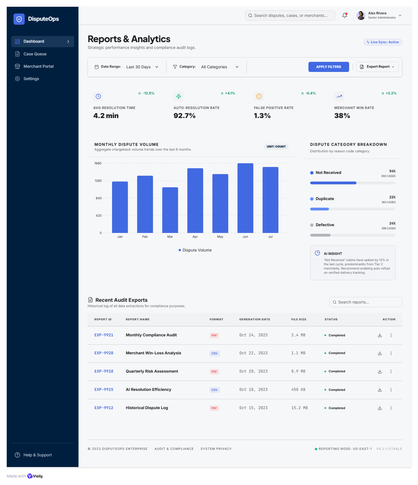

- **Key UI Elements:**
  - **Filter Toolbar:** Date range presets (`Last 30 Days`), Category filter (`All Categories`), `[APPLY FILTERS]`, and `[Export Report ▾]`.
  - **Platform KPI Summary Strip:**
    - **Avg Resolution Time:** `4.2 min` (-12.5%).
    - **Auto-Resolution Rate:** `92.7%` (+4.1%).
    - **False Positive Rate:** `1.3%` (-0.4%, beating < 2% target per NFR-14).
    - **Merchant Win Rate:** `38%` (+2.2%).
  - **Monthly Dispute Volume Bar Chart:** Monthly intake counts from January to July.
  - **Dispute Category Distribution:** Breakdown across `Not Received` (54%), `Duplicate` (22%), and `Defective` (24%) with proactive AI Insight advisory box.
  - **Recent Audit Exports Table:** Downloadable compliance audit packages (`EXP-9921`, `EXP-9920`, etc.) in PDF and CSV formats.
- **API Mapping:** `GET /api/v1/admin/reports/summary`, `GET /api/v1/admin/reports/export`.
- **SRS Alignment:** FR-29, US-AD-04, AC-15.

---

### Screen WEB-11: System Configuration & AI Model Settings
Administrative control center for calibrating model confidence thresholds, operational SLAs, notification templates, and team access.

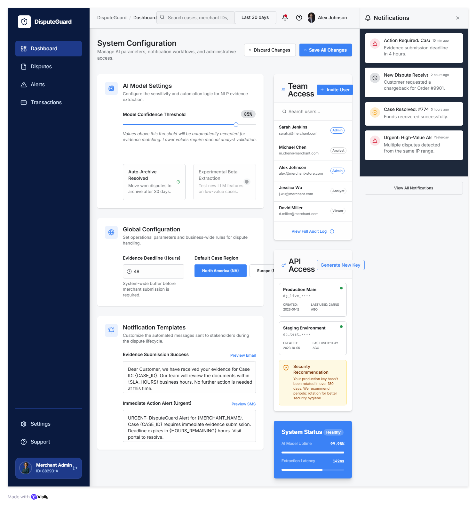

- **Key UI Elements:**
  - **AI Model Settings Panel:**
    - Interactive **Model Confidence Threshold Slider:** Set to `85%` (values above are auto-accepted; lower values escalate to human queue).
    - Feature toggles: Auto-Archive Resolved disputes (after 30 days) and Experimental Beta LLM Extraction.
  - **Global Configuration Panel:**
    - Evidence Deadline buffer configuration (`48` hours).
    - Default Case Region selector (`North America`, `Europe`, `Asia-Pacific`).
  - **Notification Templates Editor:** Customizable template strings for *Evidence Submission Success* and *Immediate Action Alerts* with real-time preview modals.
  - **Team Access Management:** List of authorized operators with role chips (`Admin`, `Analyst`, `Viewer`) and `[+ Invite User]` button.
  - **API Access Credentials:** Production and staging secret key management with rotation recommendations and security audit warnings.
  - **System Status Health Card:** Real-time uptime (`99.98%`) and NLP extraction latency indicator (`142ms`).
- **API Mapping:** `GET /api/v1/admin/config`, `PUT /api/v1/admin/config`.
- **SRS Alignment:** Section 8 Settings (System Settings), FR-17, FR-18.

---

### Screen WEB-12: Merchant Profile Management & Connected Accounts
Merchant business entity configuration, alert notification channels, and payment processor API integrations.

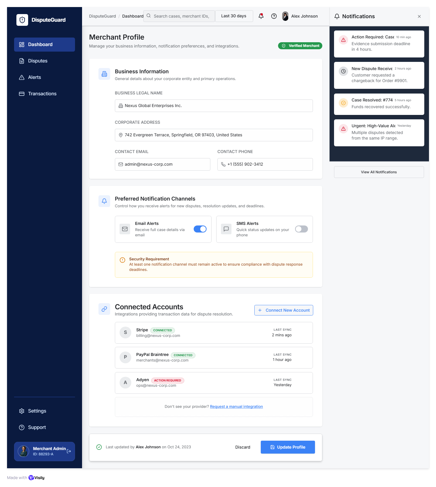

- **Key UI Elements:**
  - **Business Information Card:** Legal entity name (`Nexus Global Enterprises Inc.`), corporate address, contact email, and phone with inline editing.
  - **Preferred Notification Channels:** Toggles for Email Alerts (full case dossiers) and SMS Alerts (instant deadline pings) with mandatory minimum channel enforcement.
  - **Connected Accounts / Payment Gateways:**
    - Live integration cards for payment processors: `Stripe` (`CONNECTED`, last sync 2 mins ago), `PayPal Braintree` (`CONNECTED`, last sync 1 hour ago), and `Adyen` (`ACTION REQUIRED`, credential reconnect prompt).
    - `[+ Connect New Account]` CTA button and custom provider request link.
  - **Action Footer:** `[Discard]` and `[Update Profile]` buttons with last modification audit stamp.
- **API Mapping:** `GET /api/v1/merchant/profile`, `PUT /api/v1/merchant/profile`, `GET /api/v1/merchant/integrations`.
- **SRS Alignment:** Section 8 Settings (Merchant Profile), FR-01, FR-05.

---

### Screen WEB-13: Empty State — Zero Active Disputes
Friendly zero-state display reassuring merchants that their revenue is protected with zero active contested charges.

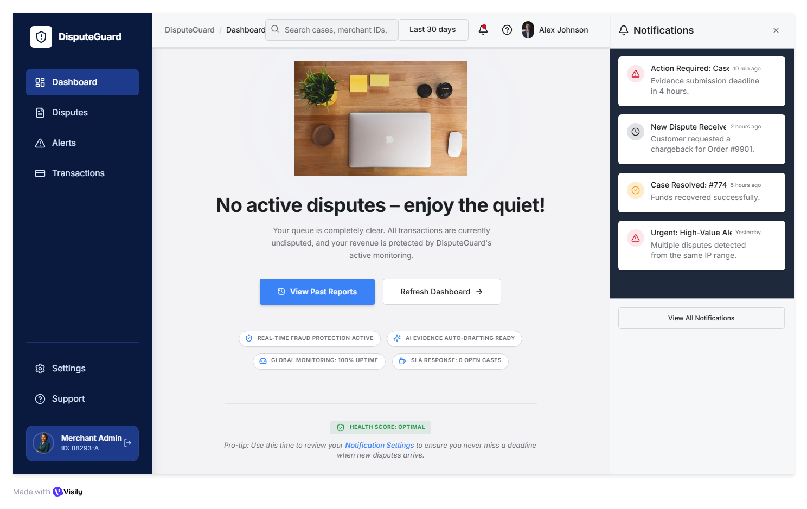

- **Key UI Elements:**
  - Clean desktop photograph illustration.
  - Reassuring header: *"No active disputes — enjoy the quiet!"*.
  - Descriptive copy: *"Your queue is completely clear. All transactions are currently undisputed, and your revenue is protected by DisputeOps' active monitoring."*.
  - Primary CTAs: `[View Past Reports]` and `[Refresh Dashboard ->]`.
  - System status chips: *Real-Time Fraud Protection Active*, *AI Evidence Auto-Drafting Ready*, *Global Monitoring: 100% Uptime*, *SLA Response: 0 Open Cases*.
  - Pro-tip callout guiding users to review notification settings during low-volume periods.
- **SRS Alignment:** Section 8 States (Empty State).

---

### Screen WEB-14: 404 Error Page & Fallback State
Resilient fallback error page guiding users back to active dispute workflows in the event of broken links or missing resources.

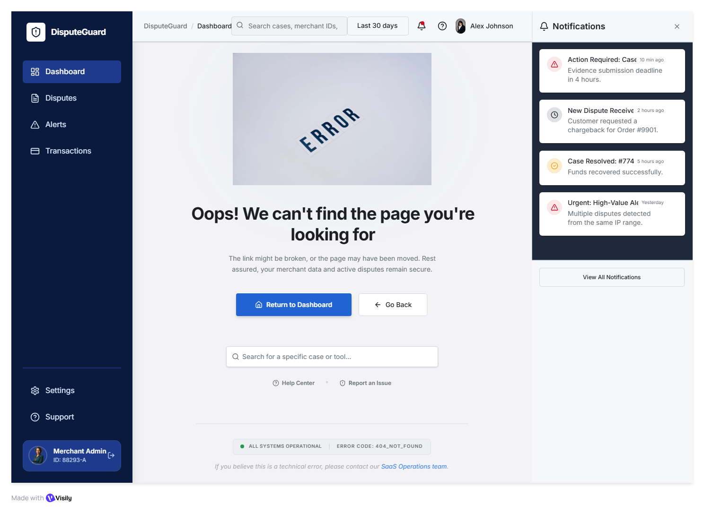

- **Key UI Elements:**
  - High-contrast visual error graphic with bold heading: *"Oops! We can't find the page you're looking for"*.
  - Reassurance subtext: *"The link might be broken, or the page may have been moved. Rest assured, your merchant data and active disputes remain secure."*.
  - Action buttons: `[Return to Dashboard]` (primary blue) and `[<- Go Back]` (secondary outline).
  - Inline search bar: *"Search for a specific case or tool..."*.
  - Quick links to Help Center and Issue Reporter.
  - System diagnostics footer: `ALL SYSTEMS OPERATIONAL` badge and error code reference (`404_NOT_FOUND`).
- **SRS Alignment:** Section 8 States (Error / 404 Page).

---

## 🏛️ 5. Updated React Component Hierarchy Tree

```
VerdictAI Web Console (React 18)
├── App.tsx (React Router v6 + AuthProvider + ThemeProvider)
│   ├── Layout/
│   │   ├── NavigationSidebar.tsx (Navy #0F172A, Role-Aware Routes, Collapsible)
│   │   ├── GlobalHeader.tsx (User Profile, Notifications Drawer, Role Switcher)
│   │   └── MainContentContainer.tsx (Fluid Canvas, Responsive Grid)
│   │
│   ├── pages/
│   │   ├── auth/
│   │   │   ├── LoginPage.tsx (WEB-01: Role Selector, Credentials, 2FA Modal)
│   │   │   └── PasswordRecoveryPage.tsx (WEB-02: 3-Step Wizard, Email & OTP Reset)
│   │   ├── admin/
│   │   │   ├── AdminDashboardPage.tsx (WEB-03: KPI Cards, Charts, Case Queue)
│   │   │   ├── AnalystCaseQueuePage.tsx (WEB-05: Multi-Filter Toolbar, Paginated Queue)
│   │   │   ├── CaseDetailPage.tsx (WEB-06: Metadata, Evidence Grid, Score Gauge, XAI Box)
│   │   │   ├── EvidenceReviewPage.tsx (WEB-07: Side-by-side Claims, NLP Extraction Grid)
│   │   │   ├── OverrideConsolePage.tsx (WEB-09: Decision Engine, Reason Area, Audit Trail)
│   │   │   ├── ReportsAnalyticsPage.tsx (WEB-10: Volume Trends, Category Bars, Audit Exports)
│   │   │   └── SystemConfigPage.tsx (WEB-11: Model Threshold Slider, SLA Settings, Team RBAC)
│   │   ├── merchant/
│   │   │   ├── MerchantDashboardPage.tsx (WEB-04: Active Claims, Deadlines, Recovery Rate)
│   │   │   ├── EvidenceSubmissionPage.tsx (WEB-08: Required Checklist, Drag-Drop Uploader)
│   │   │   └── MerchantProfilePage.tsx (WEB-12: Business Details, SMS/Email Alerts, Integrations)
│   │   └── states/
│   │       ├── EmptyDisputesPage.tsx (WEB-13: Reassuring Empty State, Report Links)
│   │       └── NotFoundPage.tsx (WEB-14: 404 Error State, Quick Search, Return CTA)
│   │
│   └── components/
│       ├── common/
│       │   ├── StatusBadge.tsx (Pill Badges with WCAG 2.1 AA Contrast)
│       │   ├── ScoreGauge.tsx (0–100 SVG Radial Semi-Circle Gauge)
│       │   ├── ProgressBar.tsx (Reasoning Factor & Documentation Meters)
│       │   ├── DataTable.tsx (Generic Paginated, Sortable, Multi-Column Table)
│       │   └── DateRangePicker.tsx (Quick Preset Selector)
│       ├── evidence/
│       │   ├── EvidenceCard.tsx (File Badge, Size, Menu, Lightbox Trigger)
│       │   ├── EvidenceChecklist.tsx (Interactive Required vs Optional Checklist)
│       │   ├── DragDropUploader.tsx (Client-Side Validated File Dropper, 25MB Cap)
│       │   └── NLPExtractionTable.tsx (Field-by-Field Discrepancy Comparator)
│       ├── explainability/
│       │   ├── XAINarrativeCard.tsx (Plain-Language Explanation Panel)
│       │   └── FactorWeightBar.tsx (Relative Factor Contribution Bar)
│       └── audit/
│           ├── AuditTimeline.tsx (Chronological Cryptographic Event Feed)
│           └── NotificationDrawer.tsx (Slide-over Activity & Alert Center)
```

---

## 📋 6. SRS Functional Requirements & Acceptance Criteria Alignment

| SRS Req / AC | Requirement Description | Web Wireframe Screen | Target REST API Endpoint |
| :--- | :--- | :--- | :--- |
| **FR-01, FR-02** | Role-based authentication & mandatory 2FA for Admin/Merchant | WEB-01: Login Screen, WEB-02: Password Recovery | `POST /api/v1/auth/login` |
| **FR-05** | Role-Based Access Control (RBAC) data visibility | WEB-01, WEB-11: Team Access Management | `GET /api/v1/admin/users` |
| **FR-11, FR-12** | Multi-source evidence collection & NLP entity parsing < 60s | WEB-06: Case Detail, WEB-07: Evidence Review Panel | `GET /api/v1/evidence/{id}/parsed` |
| **FR-13, AC-06** | Unavailable evidence labelled "Missing" without blocking scoring | WEB-07: Missing document placeholder card | `GET /api/v1/evidence/{id}` |
| **FR-14, AC-07** | Merchant additional evidence upload after auto-collection | WEB-08: Merchant Evidence Submission Form | `POST /api/v1/evidence/upload` |
| **FR-15, FR-16** | 0–100 Fair-weighing score and confidence rating | WEB-06: Radial Semi-Circle Gauge (72% Favour Member) | `GET /api/v1/disputes/{id}` |
| **FR-17** | Escalation of low-confidence (< 50%) cases to admin queue | WEB-05: Case Queue, WEB-09: Admin Override Console | `GET /api/v1/disputes?status=ESCALATED` |
| **FR-18** | Scoring criteria, factor weights, and model version recorded | WEB-06, WEB-09: AI Evidence Summary & Audit Trail | `GET /api/v1/audit/logs/{id}` |
| **FR-19, FR-20** | Plain-language XAI explanation in non-technical terms | WEB-06: Dedicated AI Narrative Summary panel | `GET /api/v1/disputes/{id}/rationale` |
| **FR-22, FR-24** | Real-time status tracker & 48h/24h evidence deadline countdowns | WEB-04: Merchant Dashboard, WEB-08: Active Claims | `GET /api/v1/merchant/disputes` |
| **FR-25, AC-12** | Paginated case queue with multi-filter loading < 2s | WEB-03: Dashboard Queue, WEB-05: Analyst Case Queue | `GET /api/v1/disputes` |
| **FR-27, AC-13** | Admin override with mandatory written reason blocking | WEB-09: Manual Decision Engine & Textarea | `POST /api/v1/admin/override` |
| **FR-28** | Assign cases to analysts, add internal notes | WEB-05: Queue Assignment Filter, WEB-07: Annotations | `POST /api/v1/disputes/{id}/assign` |
| **FR-29, AC-15** | Exportable compliance audit reports (PDF/CSV) < 30s | WEB-10: Reports & Compliance Analytics Export Table | `GET /api/v1/admin/reports/export` |
| **FR-32** | All transitions logged in immutable audit trail | WEB-06, WEB-07, WEB-09: Override Audit Trail | `GET /api/v1/audit/logs/{id}` |
| **UIR-01** | Responsive layout for screens $\ge 1024\text{px}$ width | All Screens: Desktop-first responsive layout specs | N/A (CSS Grid / Tailwind) |
| **UIR-04** | WCAG 2.1 AA compliant contrast ratios ($\ge 4.5:1$) | Section 3.1: Curated accessible color tokens | Design System Tokens |
| **UIR-06** | Drag-and-drop file upload with progress (up to 25MB) | WEB-08: Drag & drop uploader with size validation | `POST /api/v1/evidence/upload` |
| **UIR-08** | Plain-language explanation in visually distinct panel | WEB-06: Dedicated blue-bordered narrative container | Frontend Layout Token |

---

## 🚀 7. Engineering Roadmap & Implementation Plan (Frontend Web)

1. **Phase 1 Deliverables Sign-off (Current):**
   - High-fidelity wireframe specifications and screen catalog completed for all 14 screens.
   - Design system tokens, color palettes, and component hierarchy finalized.
2. **Phase 2 & 3 Support:**
   - Align frontend mock schema with backend Pydantic models (`DisputeCase`, `EvidencePayload`, `AuditLogEntry`).
3. **Phase 4 Implementation (Client Interfaces):**
   - Implement the remaining newly added screens (`PasswordRecoveryPage`, `MerchantDashboardPage`, `AnalystCaseQueuePage`, `EvidenceReviewPage`, `SystemConfigPage`, `MerchantProfilePage`, `EmptyDisputesPage`, and `NotFoundPage`) into the `web-app/` codebase following user approval.
